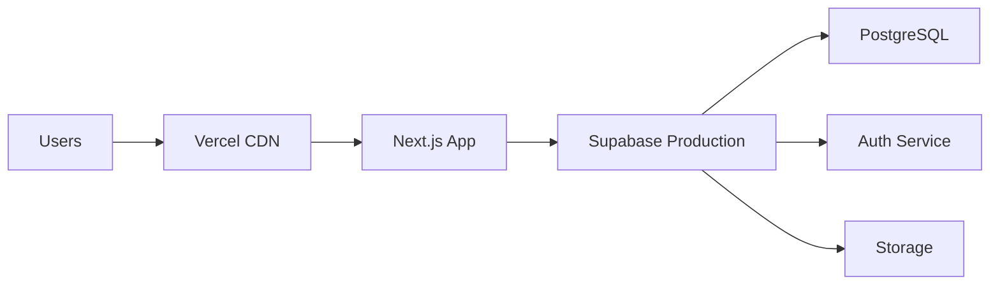

<Note>
  This guide covers production deployment using Vercel for hosting and Supabase for the database. The entire process takes approximately 15-20 minutes.
</Note>

## Prerequisites

Before deploying to production, ensure you have:

- A **Vercel account** (free tier available at [vercel.com](https://vercel.com))
- A **Supabase production project** (separate from your development project)
- **Git repository** with your code (GitHub, GitLab, or Bitbucket)
- **Domain name** (optional, Vercel provides a free subdomain)

<Warning>
  Never use your development Supabase project in production. Always create a separate production project to avoid data conflicts and ensure proper backups.
</Warning>

## Deployment architecture

Your production setup will consist of:



- **Vercel**: Hosts the Next.js application with automatic SSL, CDN, and edge functions
- **Supabase**: Provides PostgreSQL database, authentication, and real-time subscriptions
- **Edge Runtime**: Next.js middleware runs on Vercel's edge network for fast authentication checks

## Step-by-step deployment

<Steps>
  <Step title="Create Supabase production project">
    Set up your production database:
    
    1. Go to [Supabase Dashboard](https://app.supabase.com/)
    2. Click **New Project**
    3. Choose a project name: `pramukh-production`
    4. Set a **strong database password** (save this securely)
    5. Select a **region** closest to your users
    6. Choose a pricing plan (free tier works for small deployments)
    7. Wait for the project to provision (2-3 minutes)
    
    <Info>
      Choose the region carefully - it cannot be changed later. For India-based operations, select the Singapore region for best latency.
    </Info>
  </Step>
  
  <Step title="Run database migrations">
    Apply the schema to your production database:
    
    ```bash
    # Link to your production project
    supabase link --project-ref <your-production-project-ref>
    
    # Push migrations
    supabase db push
    ```
    
    The project ref can be found in your Supabase project settings under **General** → **Reference ID**.
    
    <Accordion title="Alternative: Manual migration via SQL">
      If you prefer to run migrations manually:
      
      1. Open Supabase Studio for your production project
      2. Navigate to **SQL Editor**
      3. Copy the contents of `supabase/migrations/0001_initial_schema.sql`
      4. Paste and execute the SQL
      5. Verify all tables were created under **Table Editor**
    </Accordion>
  </Step>
  
  <Step title="Configure production environment variables">
    Gather your production Supabase credentials:
    
    1. In Supabase Dashboard, go to **Settings** → **API**
    2. Copy the **Project URL** (e.g., `https://xxxyyyzzz.supabase.co`)
    3. Copy the **anon/public key**
    4. Copy the **service_role key** (for migrations and admin tasks)
    
    You'll need these in the next step for Vercel configuration.
    
    <Warning>
      The service_role key grants full database access. Only use it in secure server-side code, never in the browser.
    </Warning>
  </Step>
  
  <Step title="Deploy to Vercel">
    Connect your repository to Vercel:
    
    1. Go to [Vercel Dashboard](https://vercel.com/dashboard)
    2. Click **Add New** → **Project**
    3. Import your Git repository (GitHub/GitLab/Bitbucket)
    4. Select the repository containing Pramukh Men's Wear
    5. Configure project settings:
       - **Framework Preset**: Next.js (auto-detected)
       - **Root Directory**: `./` (or your subdirectory if applicable)
       - **Build Command**: `pnpm build` (or `npm run build`)
       - **Output Directory**: `.next` (default)
    6. Add environment variables (see below)
    7. Click **Deploy**
    
    **Environment variables to add:**
    
    ```bash
    NEXT_PUBLIC_SUPABASE_URL=https://xxxyyyzzz.supabase.co
    NEXT_PUBLIC_SUPABASE_ANON_KEY=eyJhbGciOiJIUzI1NiIsInR5cCI6IkpXVCJ9...
    SUPABASE_SERVICE_ROLE_KEY=eyJhbGciOiJIUzI1NiIsInR5cCI6IkpXVCJ9...
    ```
    
    <Info>
      Vercel automatically encrypts environment variables. They are only accessible during build and runtime, never exposed to the client (unless prefixed with `NEXT_PUBLIC_`).
    </Info>
  </Step>
  
  <Step title="Create initial admin user">
    Set up the first user in your production system:
    
    ```bash
    # Using Supabase CLI (linked to production)
    supabase auth signups create \
      --email admin@yourdomain.com \
      --password YourStrongProductionPassword
    
    # Create user profile
    supabase db query "insert into public.user_profile (id, full_name, role) values ('<USER_ID>', 'System Administrator', 'owner');"
    
    # Create production branch
    supabase db query "insert into public.branch (code, name, address, phone) values ('HQ', 'Headquarters', '123 Main Street, City', '+91-1234567890');"
    
    # Assign user to branch
    supabase db query "insert into public.branch_user (branch_id, user_id, role) select b.id, u.id, 'owner' from public.branch b join public.user_profile u on u.id = '<USER_ID>' where b.code = 'HQ';"
    ```
    
    <Accordion title="Using Supabase Studio instead">
      Prefer a GUI? Use Supabase Studio:
      
      1. Go to **Authentication** → **Users** → **Add User**
      2. Enter email and password, click **Create User**
      3. Copy the user UUID
      4. Go to **Table Editor** → `user_profile` → **Insert Row**
      5. Paste UUID in `id`, add name and role
      6. Repeat for `branch` and `branch_user` tables
    </Accordion>
  </Step>
  
  <Step title="Verify deployment">
    Test your production deployment:
    
    1. Visit your Vercel deployment URL (e.g., `https://pramukh-mens-wear.vercel.app`)
    2. You should be redirected to `/login`
    3. Enter your admin credentials from Step 5
    4. Verify you land on the dashboard
    5. Check that branch name appears correctly in the header
    6. Test navigation to Inventory, POS, and other sections
    
    <Check>
      All pages should load without errors. Check the browser console (F12) for any warnings or errors.
    </Check>
  </Step>
  
  <Step title="Configure custom domain (optional)">
    Add your own domain to Vercel:
    
    1. In Vercel project settings, go to **Domains**
    2. Click **Add Domain**
    3. Enter your domain (e.g., `pos.yourdomain.com`)
    4. Follow DNS configuration instructions:
       - **A Record**: Point to Vercel's IP
       - **CNAME**: Point to `cname.vercel-dns.com`
    5. Wait for DNS propagation (5 minutes to 48 hours)
    6. Vercel automatically provisions SSL certificate
    
    <Info>
      Vercel handles SSL certificate renewal automatically. No manual intervention required.
    </Info>
  </Step>
</Steps>

## Production environment variables

All environment variables used in production:

<ParamField path="NEXT_PUBLIC_SUPABASE_URL" type="string" required>
  Your Supabase project URL. Visible to the browser.
  
  Example: `https://xxxyyyzzz.supabase.co`
</ParamField>

<ParamField path="NEXT_PUBLIC_SUPABASE_ANON_KEY" type="string" required>
  Supabase anonymous/public key for client-side API calls. Visible to the browser but rate-limited by Row Level Security.
  
  Example: `eyJhbGciOiJIUzI1NiIsInR5cCI6IkpXVCJ9...`
</ParamField>

<ParamField path="SUPABASE_SERVICE_ROLE_KEY" type="string">
  Service role key for server-side admin operations. **Never expose to browser**. Optional for basic operations but required for migrations and admin tasks.
  
  Example: `eyJhbGciOiJIUzI1NiIsInR5cCI6IkpXVCJ9...`
</ParamField>

<Warning>
  Do NOT commit `.env.local` or any file containing these keys to version control. Add them to `.gitignore`.
</Warning>

## Database migration strategy

As your application evolves, you'll need to update the production database schema:

### Creating new migrations

```bash
# Create a new migration file
supabase migration new add_product_images

# Edit supabase/migrations/<timestamp>_add_product_images.sql
# Add your SQL changes

# Test locally first
supabase db reset  # Drops and recreates local DB

# Push to production when ready
supabase db push
```

### Migration best practices

<AccordionGroup>
  <Accordion title="Always test migrations locally first">
    Never run untested migrations on production. Use `supabase db reset` locally to ensure migrations work from scratch.
  </Accordion>
  
  <Accordion title="Make migrations reversible">
    Include both `up` and `down` migrations when possible. For example:
    
    ```sql
    -- Up migration
    alter table item add column image_url text;
    
    -- Down migration (in separate file if needed)
    alter table item drop column image_url;
    ```
  </Accordion>
  
  <Accordion title="Avoid data loss">
    When dropping columns or tables:
    1. Rename instead of drop (e.g., `old_column_name`)
    2. Wait one deployment cycle
    3. Then drop in next migration if no issues
  </Accordion>
  
  <Accordion title="Use transactions">
    Wrap related changes in transactions:
    
    ```sql
    begin;
      alter table sale add column discount_percentage numeric(5,2);
      update sale set discount_percentage = (discount_total / subtotal) * 100;
    commit;
    ```
  </Accordion>
</AccordionGroup>

## Performance optimization

### Edge runtime configuration

The middleware runs on Vercel's edge network for fast authentication:

```typescript middleware.ts
export const config = {
  matcher: [
    '/((?!_next/static|_next/image|favicon.ico|.*\\.(?:svg|png|jpg|jpeg|gif|webp)$).*)',
  ],
}
```

This ensures static assets bypass middleware for optimal performance.

### Database indexing

The initial schema includes key indexes:

```sql
-- Sale queries by branch
create index sale_branch_id_idx on public.sale (branch_id);

-- Item variant lookups
create index item_variant_item_id_idx on public.item_variant (item_id);

-- Customer payment history
create index customer_payment_customer_idx on public.customer_payment (customer_id);
```

Monitor slow queries in Supabase Dashboard → **Database** → **Query Performance**.

### Caching strategy

Next.js automatically caches:
- Server component renders
- Static assets (CSS, JS, images)
- API route responses (when configured)

For dynamic data like sales and inventory, the app uses Supabase real-time subscriptions to stay updated without polling.

## Monitoring & maintenance

### Vercel analytics

Enable analytics in Vercel project settings:

1. Go to **Analytics** tab
2. Enable **Web Analytics** (free tier: 100k events/month)
3. View page views, response times, and errors

### Supabase monitoring

Monitor your database in Supabase Dashboard:

- **Database** → **Usage**: Track storage, bandwidth, and query performance
- **API** → **Logs**: View real-time API requests and errors
- **Authentication** → **Users**: Monitor user signups and login activity

### Backup strategy

<Warning>
  Supabase free tier does NOT include automatic backups. Upgrade to Pro ($25/month) for daily backups with 7-day retention.
</Warning>

**Manual backup options:**

```bash
# Export database to SQL file
supabase db dump -f backup_$(date +%Y%m%d).sql

# Schedule this as a cron job or GitHub Action
```

**Recommended production setup:**
- Supabase Pro plan for automatic backups
- Point-in-time recovery enabled
- Regular manual exports of critical data

## Security considerations

### Row Level Security (RLS)

<Note>
  The current schema does NOT include RLS policies. For production, you should add policies to restrict data access based on user roles.
</Note>

Example RLS policy for branch-specific sales:

```sql
-- Enable RLS on sale table
alter table public.sale enable row level security;

-- Policy: Users can only see sales from their assigned branches
create policy "Users see only their branch sales"
  on public.sale
  for select
  using (
    branch_id in (
      select branch_id 
      from public.branch_user 
      where user_id = auth.uid()
    )
  );
```

### Environment variable security

<AccordionGroup>
  <Accordion title="Never log environment variables">
    Avoid `console.log(process.env)` in production code. Use Vercel's logs instead.
  </Accordion>
  
  <Accordion title="Rotate keys periodically">
    Regenerate Supabase keys every 90 days:
    1. Create new keys in Supabase Dashboard
    2. Update Vercel environment variables
    3. Redeploy the application
    4. Revoke old keys
  </Accordion>
  
  <Accordion title="Use separate keys per environment">
    - Development: Use `anon` key with relaxed RLS
    - Staging: Separate Supabase project
    - Production: Separate Supabase project with strict RLS
  </Accordion>
</AccordionGroup>

### HTTPS and CORS

Vercel enforces HTTPS by default. Ensure your custom domain redirects HTTP to HTTPS:

```typescript next.config.ts
const nextConfig = {
  async headers() {
    return [
      {
        source: '/(.*)',
        headers: [
          {
            key: 'Strict-Transport-Security',
            value: 'max-age=31536000; includeSubDomains'
          },
        ],
      },
    ]
  },
}
```

## Scaling considerations

### Vertical scaling (Supabase)

As your data grows:

| Metric | Free Tier | Pro Tier | Enterprise |
|--------|-----------|----------|------------|
| Storage | 500 MB | 8 GB | Unlimited |
| Bandwidth | 2 GB | 50 GB | Custom |
| Concurrent connections | 60 | 200 | Custom |
| API requests | 500k/month | Unlimited | Unlimited |

### Horizontal scaling (Vercel)

Vercel automatically scales:
- **Edge functions**: 100ms p95 response time globally
- **Serverless functions**: Scale to thousands of concurrent requests
- **CDN**: Automatic asset distribution across 100+ regions

<Info>
  Next.js App Router with React Server Components ensures optimal performance by rendering on the server and sending minimal JavaScript to the client.
</Info>

## Deployment checklist

Before going live:

- [ ] Production Supabase project created
- [ ] Database migrations applied and tested
- [ ] Environment variables configured in Vercel
- [ ] Initial admin user created
- [ ] Custom domain configured (if applicable)
- [ ] SSL certificate verified
- [ ] Test login flow works
- [ ] Test key features (POS, inventory, dashboard)
- [ ] Browser console shows no errors
- [ ] Mobile responsiveness checked
- [ ] Row Level Security policies implemented
- [ ] Backup strategy in place
- [ ] Monitoring and alerts configured

## Troubleshooting

<AccordionGroup>
  <Accordion title="Error: Failed to connect to Supabase">
    **Cause**: Incorrect environment variables or network issue
    
    **Solution**:
    1. Verify `NEXT_PUBLIC_SUPABASE_URL` has no trailing slash
    2. Confirm anon key matches production project
    3. Check Supabase project is not paused
    4. Test connection from Supabase Studio SQL editor
  </Accordion>
  
  <Accordion title="Error: Invalid token or session">
    **Cause**: Cookie domain mismatch or JWT secret changed
    
    **Solution**:
    1. Clear browser cookies
    2. Verify Supabase JWT secret hasn't changed
    3. Check cookie `SameSite` and `Secure` attributes
    4. Ensure domain matches in Supabase Auth settings
  </Accordion>
  
  <Accordion title="Build fails on Vercel">
    **Cause**: Missing dependencies or TypeScript errors
    
    **Solution**:
    1. Run `pnpm build` locally to reproduce
    2. Check Vercel build logs for specific errors
    3. Ensure all dependencies are in `package.json` (not just devDependencies)
    4. Verify Node.js version matches (`engines` in package.json)
  </Accordion>
  
  <Accordion title="Slow page loads">
    **Cause**: Large data queries or missing indexes
    
    **Solution**:
    1. Check Supabase Query Performance dashboard
    2. Add indexes on frequently queried columns
    3. Implement pagination for large result sets
    4. Use `select()` with specific columns instead of `*`
    5. Enable Next.js caching for static data
  </Accordion>
</AccordionGroup>

## Post-deployment tasks

After successful deployment:

<Steps>
  <Step title="Train your team">
    - Create user accounts for staff (owners, managers, cashiers)
    - Assign users to their respective branches
    - Demonstrate key workflows (POS, inventory, reports)
  </Step>
  
  <Step title="Import existing data">
    - Export data from old system to CSV
    - Write SQL scripts to import into Supabase
    - Validate data integrity after import
  </Step>
  
  <Step title="Set up monitoring">
    - Configure email alerts for errors (Vercel + Supabase)
    - Set up uptime monitoring (UptimeRobot, Pingdom)
    - Create dashboard for business metrics
  </Step>
  
  <Step title="Plan for growth">
    - Document custom workflows and business rules
    - Schedule regular database backups
    - Plan for feature enhancements based on user feedback
  </Step>
</Steps>

## Need help?

<CardGroup cols={2}>
  <Card title="Vercel Documentation" icon="book" href="https://vercel.com/docs">
    Official Vercel deployment guides and troubleshooting
  </Card>
  
  <Card title="Supabase Docs" icon="database" href="https://supabase.com/docs">
    Database, authentication, and API documentation
  </Card>
  
  <Card title="Next.js Deployment" icon="rocket" href="https://nextjs.org/docs/deployment">
    Next.js production optimization and deployment best practices
  </Card>
  
  <Card title="Database Schema" icon="sitemap" href="/setup/database-schema">
    Understand the complete database structure and relationships
  </Card>
</CardGroup>